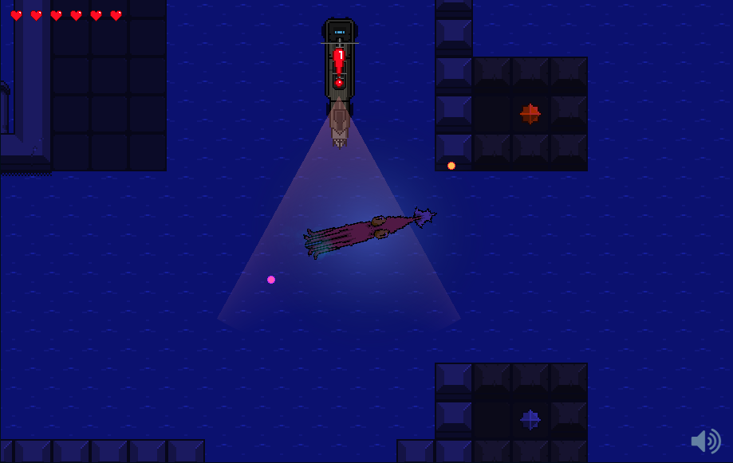
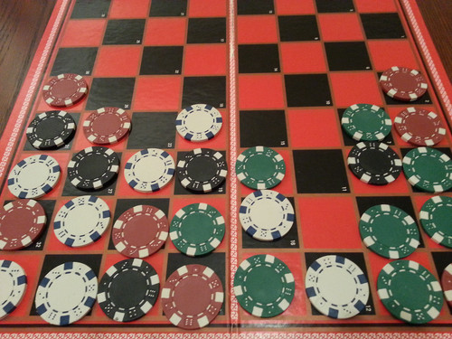

Title: "Game Development – A Year in Review 2014"
Published: 1/9/2015
Tags:
- News
- Game Dev
- Excalibur
RedirectFrom: blog/game-development-a-year-in-review-2014/index.html
disqus_identifier: https://erikonarheim.com/blog/game-development-a-year-in-review-2014/
---

This year I have really been exploring my passion for game development, and I feel like I’ve learned some useful things that I would like to share. Full disclaimer: this is mostly all unsubstantiated opinions.

I attempted to do the "One Game a Month" challenge (which I recommend to anyone into games or wanting to improve their game making ability). It’s great because it forces you to build a product every month, and even if you don’t succeed you still get great practice. There are always more ideas than there is time, and this is a great way to explore many ideas in a short amount of time. It also prevents you into falling into the trap of the magnum opus idea, where you believe your idea to be more awesome than it actually is. It is so easy to wind up being more concerned about protecting your magnum opus from others than actually finding out if it’s good at all.

I participated in a number of game jams this year including Ludum Dare 29 (Jam), Public Domain Jam, and Ludum Dare 31 (Jam). I think the three biggest lessons I’ve learned from jamming have been how to manage scope, how to brainstorm properly, and prototyping.

Kraken Unchained for Ludum Dare 29

 
Sleepy Hollow for the Public Domain Jam

 
Sweep Stacks for Ludum Dare 31

Managing scope, especially when you are really excited about an idea, is hard. It’s easy to want to build the biggest, coolest, and most awesome thing around, but in a game jam you have limited time, resources, and people forcing you to face reality. I think Rami Ismail of Vlambeer fame said it best, "Your scope is too damn big!". As a team working on our LD 29 game, kraken unchained, we definitely learn that we sucked at managing scope. Over the course of this year we have relearned this lesson time and time again. Lately, we have begun to use the phrase minimum viable game to get at the root of a game idea, basically what is the simplest possible version of this game that is still interesting. In Ludum Dare 31, which yielded sweep stacks, we originally had a fantasy theme where the blocks were a marching army heading towards a castle wall, and you controlled a wizard zapping orcs, goblins, and spiders as they approached. Obviously, this really didn’t make the game any more fun than it is right now and we wound up cutting the idea all together since colored blocks were just as fun.

For each of the jams, our group brainstorming process has evolved fairly organically and I feel like the results have been awesome. Basically, our method is throw out and fully explore every idea that everyone puts out until there are no more ideas and everyone agrees on one. This process generally takes approximately 4 hours of intense discussion, and a willingness to not get stuck on a particular idea just because you like it (caveat this process may not scale past a few people). There are so many ideas, and if you stop at the first "good" one, you will miss out on all of those other ideas that might actually be better. In the case of Ludum 31, there were a couple of ideas that I really wanted to do before we got to the ideas that spawned Sweep Stacks. I’d argue that because we continued to brainstorm we arrived at the best game possible, and it turned out to be really fun.

During our last jam, we used a physical prototype for the game that would eventually become Sweep Stacks, and I cannot stress how well it worked for us. Our prototype was basically a checker board and some colored poker chips, then we took turns playing, suggesting new ideas and mechanics, and acting as the "game engine".

Using prototypes is a great way to cheaply test new ideas and mechanics to make sure they are fun, don’t break the game, or have any problems. In our case we spotted one of the biggest problems, which we named the "shaft of doom", basically it is possible to play in such a way that stacks of unclearable blocks rise to the top where the game will end abruptly. This was a huge problem...

Before writing a single line of code, we were able to observe potential problems and come up with solutions, and our solution was the basic “sweep” mechanic that will either let you clear blocks of a single color or the mega "sweep" which clears the entire board at once. Boom! Problems solved before code was written all with a couple of poker chips.

After all of these experiences, I’ve learned so much and gained a lot of respect for the game development community. It is not an easy thing to build a game, let alone offer it up to the masses for criticism. The masses can be very cruel. And in general, I’ve been really impressed with the indie game development community, everyone I have meet and spoken or interacted with has been so supportive and cool. We all are here because of our passions, and that is just so cool. I wish every online community was like this one.

Do I feel like a "real" game developer after this year? yes. Did I just change my twitter bio to reflect that? yup 🙂

Cheers!
Erik