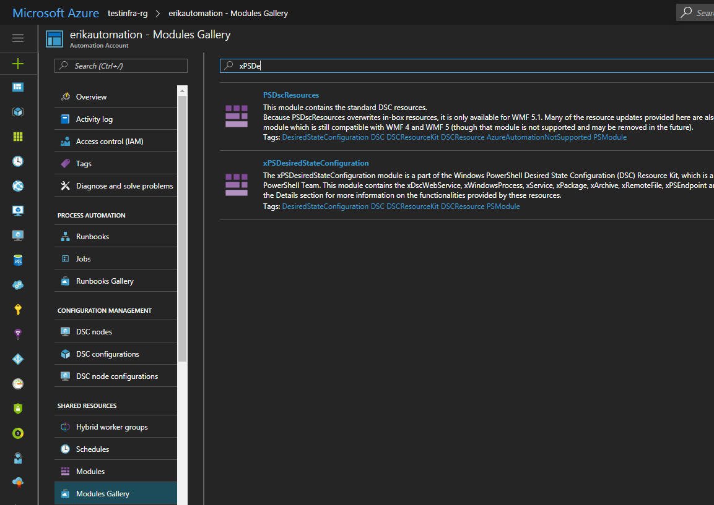
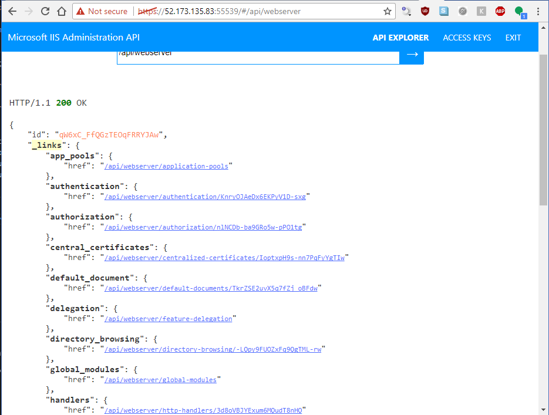

Title: IIS Administration REST API with PowerShell DSC in Azure
Published: 6/17/2017
Tags:
- IIS
- PowerShell DSC
- Azure
- DevOps
disqus_identifier: https://erikonarheim.com/blog/iis-admin-rest-api-with-dsc/
---

For a long time I have been using the good ol'fashioned DCOM based ServerManager client from Microsoft.Web.Administration.dll to configure IIS web servers. Now there is a nifty new [open source administration REST api](https://github.com/Microsoft/IIS.Administration) from Microsoft! OMGWTFBACON! This a great boon to your "DevOps" play because any language that speaks HTTP can be used to manage IIS cluster no matter how large or small! In this post I'll introduce you to PowerShell Desired State Configuration to install this powerful management tool in your environment. Like a boss 😎


### What is DSC?

PowerShell DSC is a super powerful desired state configuration tool that comes with your windows server as a part of WMF (it is similar in concept to Puppet or Chef which can also work with windows servers). DSC can be setup in multiple ways: "Pull" or "Push". In my environment we've setup things in a Pull configuration, where enrolled nodes check into the central Pull server every thirty minutes for configuration. Push is an on demand process that pushes config to target nodes with an admin credential. Optionally, you could use azure automation as a pull server in the cloud to manage your on-prem or cloud windows machines.


### Constructing the DSC

This is actually pretty easy to setup manually following the steps outlined on the Microsoft [github project](https://github.com/Microsoft/IIS.Administration), but if you have an environment with hundreds or thousands of servers that spin up and down, this isn't super sustainable.

First we need to setup our configuration, all configuration in DSC needs to be in a `configuration` block.

```powershell
configuration Install-IIS-Admin-Rest-Api {

    <# Todo awesome config for these righteous web servers #>
}
```

There are TONS of prebuilt [open source DSC resources](https://github.com/PowerShell/PSDscResources), along with some [experimental resources](https://github.com/PowerShell/xPSDesiredStateConfiguration) from Microsoft. Their github has tons of examples. In PowerShell 5, we can source these resources from the internet using `Install-Module -Name xPSDesiredStateConfiguration`

In order for the rest api to work there are a few requirements:
* IIS installed
* Windows authentication enabled
* URL authorization enabled
* Hostable web core enabled 
* ASP.NET Core hosting bundle
* Local in-bound firewall opened on management port 55539 (or whatever port you want)


The windows features are pretty simple, you just need to find the string for the feature you are looking for. The `Get-WindowsFeature *web*` command will get you far. Notice the `DependsOn = "[ResourceType]ResourceName"` strings, these are how you can make one resource depend on another. Unfortunately they are "stringly" typed and easy to mistype by mistake so I tend to copy paste these values.

```powershell
WindowsFeature InstallIIS {
    Name = "Web-Server"
    Ensure = "Present"
}

WindowsFeature EnableWinAuth {
    Name = "Web-Windows-Auth"
    Ensure = "Present"
    DependsOn = "[WindowsFeature]InstallIIS"
}

WindowsFeature EnableURLAuth {
    Name = "Web-Url-Auth"
    Ensure = "Present"
    DependsOn = "[WindowsFeature]InstallIIS"
}

WindowsFeature HostableWebCore {
    Name = "Web-WHC"
    Ensure = "Present"
    DependsOn = "[WindowsFeature]InstallIIS"
}
```

For installers available online you can download them on the fly with the `xRemoteFile` resource, one method of sourcing such dependencies is to check them into your git repo using git lfs. Check out my friends [post on that.](https://kamranicus.com/posts/2017-06-14-downloading-git-lfs-files-from-tfs-vsts). Otherwise you can source the direct download links like I did for this demo. Note that if you are in a corporate environment you may work behind a proxy which this resource takes into account.

```powershell
xRemoteFile DownloadDotNetCoreHostingBundle {
    Uri = "https://go.microsoft.com/fwlink/?linkid=844461" #https://docs.microsoft.com/en-us/aspnet/core/publishing/iis
    DestinationPath = "C:\temp\dnhosting.exe"
    MatchSource = $false # Match source false wont re-download if the files change
    #Proxy = "optional, your corporate proxy here"
    #ProxyCredential = "optional, your corporate proxy credential here"
}
```

The built in `Package` resource is pretty simple, it does require some hard to find metadata. I find most consistent way to discover the metadata necessary for DSC is to install it once and run `Get-WmiObject Win32_product | ft IdentifyingNumber,Name` to find it's ID and Product Name. Note that IIS `WindowsFeature` and the `xRemoteFile` installer resource dependency before we can install the hosting bundle. Then I cheat by temporarily adding `dotnet.exe` to the path to avoid a reboot.


```powershell
# Discover your product name and id with Get-WmiObject Win32_product | ft IdentifyingNumber,Name after installing it once
xPackage InstallDotNetCoreHostingBundle {
    Name = "Microsoft ASP.NET Core Module"
    ProductId = "B1B05FBB-1255-4F5B-9BAF-43B971A92613"
    Arguments = "/quiet /norestart /log C:\temp\dnhosting_install.log"
    Path = "C:\temp\dnhosting.exe"
    DependsOn = @("[WindowsFeature]InstallIIS",
                  "[xRemoteFile]DownloadDotNetCoreHostingBundle")
}

# Cheating and adding the dotnet.exe to the path to avoid reboot
Script PutDotNetOnPath {
    SetScript = {
        $env:Path = $env:Path + "C:\Program Files\dotnet\;"
    }
    TestScript = {
        return $env:Path.Contains("C:\Program Files\dotnet\;")
    }
    GetScript = {
        return @{
            SetScript = $SetScript
            TestScript = $TestScript
            GetScript = $GetSCript
            Result = "Set dotnet path"
        }
    }
}

```


Finally, lets download the Admin Rest API from Microsoft's GitHub [release page](https://github.com/Microsoft/IIS.Administration/releases/) and run the script installer. Note that in this case I use the `Archive` resource to unpzip the downloaded package into a directory for me to call later with a `Script` resource. For things that don't exist by default or in an external module, you can use `Script` resources to write vanilla powershell. The script resource has a few parts, the `SetScript` which does the work if the resource is not in compliance, `TestScript` which returns `$true` if in compliance and `$false` if not, and the `GetScript` which can be used to return the status of the node with the `@{ Result = "status"}`. 

```powershell
xRemoteFile DownloadAdminRestApi {
    Uri = "https://github.com/Microsoft/IIS.Administration/releases/download/v1.1.1/IIS.Administration.zip"
    DestinationPath = "C:\temp\IISAdministration.zip"
    MatchSource = $false
}

Archive UnzipAdminRestApi {
    Path = "C:\temp\IISAdministration.zip"
    Destination = "C:\temp\Admin\IISAdministration"
    Ensure = "Present"
    DependsOn = "[xRemoteFile]DownloadAdminRestApi"
}

Script InstallAdminRestApi {
    DependsOn = @("[Archive]UnzipAdminRestApi",
                    "[WindowsFeature]InstallIIS",
                    "[WindowsFeature]EnableURLAuth",
                    "[WindowsFeature]EnableWinAuth"
                    "[xPackage]InstallDotNetCoreHostingBundle",
                    "[Script]PutDotNetOnPath")
    SetScript = {
        # Run the IIS Administration installer
        & C:\temp\Admin\IISAdministration\setup\setup.ps1 Install -Verbose                
    }
    TestScript = {
        $svc = $null
        try {
            $svc = Get-Service "Microsoft IIS Administration" -ErrorAction SilentlyContinue
        } catch {}

        return !!$svc
    }
    GetScript = {
        return @{
            SetScript = $SetScript
            TestScript = $TestScript
            GetScript = $GetScript
            Result = "Install Admin Rest Api"
        }
    }
}
```

Let's see how it's all put together with the final configuration script! Checkout my [gist](https://gist.github.com/eonarheim/703e0f1807b26066d6a2ff5acf4f662d) with the code.

<script src="https://gist.github.com/eonarheim/703e0f1807b26066d6a2ff5acf4f662d.js"></script>

### Azure DSC Pull Server

Now let's deploy this to some servers to build our web farm using [Azure Automation DSC](https://docs.microsoft.com/en-us/azure/automation/automation-dsc-overview)

If you don't already have an Azure Automation account they are easy to create and by far the easiest way to setup a DSC pull server. But if paying for a pull server isn't your speed checkout the OSS project [Tug](https://github.com/PowerShellOrg/tug) or try [standing up your own](https://msdn.microsoft.com/en-us/powershell/dsc/pullserver).


All you need to do now is install the modules you need in your DSC environment, upload your completed configuration, and compile! In our case we need the `xNetworking` and the `xPSDesiredStateConfiguration` modules.




### Deploying to Azure VMs

Here I show the UI way to enroll, but if automation is your goal the Azure RM PowerShell SDK has a cmdlet for enrolling VM's automagically [`Register-AzureRmAutomationDscNode`](https://docs.microsoft.com/en-us/powershell/module/azurerm.automation/register-azurermautomationdscnode?view=azurermps-4.1.0)


You can test it manually by running `Update-DscConfiguration -Wait -Verbose` this is helpful when spotting any potential errors in your DSC. If there is already a configuration running you can stop it with `Stop-DscConfiguration -Force` and start it on demand with `Start-DscConfiguration –UseExisting –Verbose –Wait`. In production it may be useful to checkout the [event log](https://blogs.msdn.microsoft.com/powershell/2014/01/03/using-event-logs-to-diagnose-errors-in-desired-state-configuration/) if you need to debug configuration errors.


### Final product

And voila, you can login to the admin api with your admin credentials and generate an API token to do work (don't worry this IP is long gone 😎). You can get a single pane of glass view of your VMs using this REST Api with the Microsoft tool https://manage.iis.net/ 


Manage your cloud web farm with REST Apis!!!



So cool!
