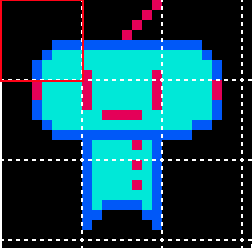
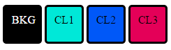
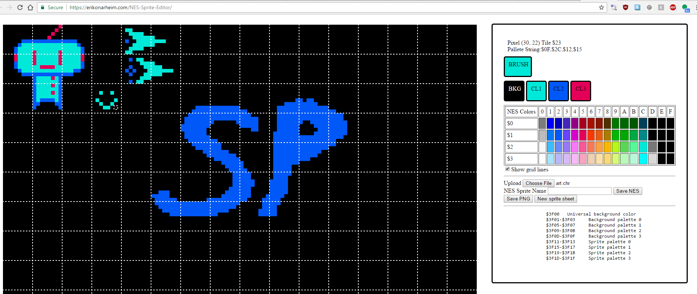
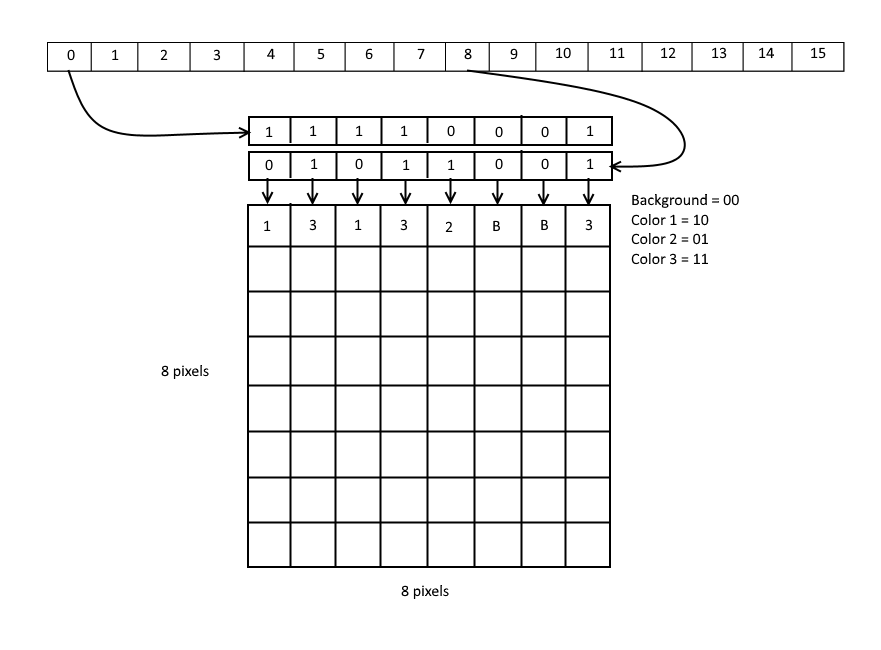
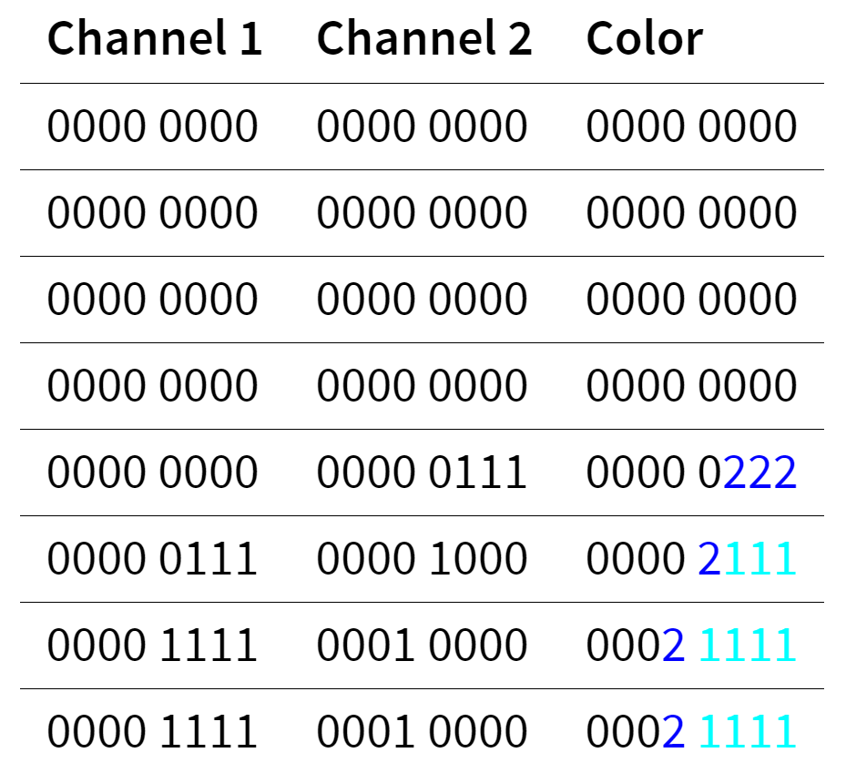
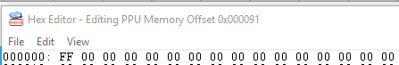
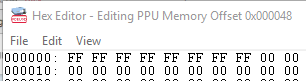
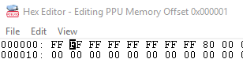
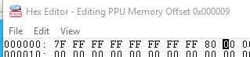
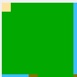

Title: Building a Sprite Editor for the NES
Published: 3/26/2017
Tags: 
 - JavaScript
 - Canvas
 - NES
 - Games
disqus_identifier: https://erikonarheim.com/posts/nes-sprite-editor/
---

I [did a talk](https://www.youtube.com/watch?v=mnUXYl5B9Qs) about building nintendo games using the [NESASM3](http://www.nespowerpak.com/nesasm/) assembler. For this talk I wanted to be able to build my own sprites rather than use existing game rom files. The unfortunate thing was I couldn't find any in-depth documentation online about how sprites worked on the Nintendo, other than they are 8x8 pixels large, take up 16-bytes, and can only define 4 possible colors (1 of which needs to be the background). 




This lead me down a path to reverse engineer the byte format of NES sprites using the emulator [FCEUX](http://www.fceux.com/web/version.html) and then build a [simple editor](https://erikonarheim.com/NES-Sprite-Editor/) that could produce sprite files format for my game. Check it out, the source is up on [github!](https://github.com/eonarheim/NES-Sprite-Editor)




### NES Sprite Format

Originally, I thought that each sequential 2-bit chuck of the 16-bytes allocated per sprite encoded the color 1-4 of the sprite. Since 2-bits can represent all four possible colors (00, 01, 10, and 10), seems pretty reasonable right? Wrong!

Actually the format is much trickier than that, still not 100% sure why Nintendo did things this way, but I can only guess that there is a performance reason behind it.

Sprites are definited by `byte n` and `byte n+8` to control the color of the first row of pixels in the 8x8 sprite. This means that the 1st byte and the 9th byte control the first row of pixels, and the 8th byte and the 16th byte control the last row of pixels for a sprite. The layout in memory to the corresponding 8x8 pixel looks like this:



Think about these two pairs of bytes (`byte n` and `byte n+8`) as separate channels, where the second channel's binary digits are weighted by 2 and the resulting color is the sum of channel 1 and channel 2 together. For example look at the sprite in the top left corner and the calculation of its colors. 




### Reverse engineering the format

Using FCEUX's PPU Viewer and PPU memory viewing feature I was able to reverse engineer the format by poking at bytes individually. It took a while to discover the scheme above, but this is roughly the trial and error process I followed to determine the colors of each pixel.

Each row of the the FCEUX hex editor is 16 bytes wide by default, which makes it convenient for testing out sprite behavior since we already know that 16 bytes are allocated per sprite. Each byte in the editor is represented by 2 hexidecimal digits where are grouped together for easy reading.


First, by setting the first byte to all 1's (hexidecimal FF) the first color in the palette was selected for the first row of the first sprite.




Next, filling out the next 7 bytes with 1's produces a solid 8x8 block. This produces color 1 in the palette.




On the 9th byte, we can change the top left pixel by entering a byte that has these binary digits `10000000` which is `80` in hexidecimal. This produces color 3 in the palette.




To produce color 2 we need to set the corresponding bit in the channel 1 byte to 0.




### Reading binary files in JavaScript

Now that we know byte format for each sprite's pixel, we can build a simple web app to help edit and make binary NES sprite files. The app I built isn't the most beautiful app ever, but it got the job done. Hopefully I'll be able to update it in the future and adding common image editing features like flood fill, selections, layers, etc.

To deal with binary data, JavaScript has a useful type called the `ArrayBuffer`. With this type we can load up bytes directly from a source files using the `XHR` method and the `FileReader` method.

```javascript
/// Upload utilities

function readBlob() {

    var files = document.getElementById('nesfile').files;
    if (!files.length) {
        alert('Please select a file!');
        return;
    }

    var file = files[0];
    var start = 0;
    var stop = file.size - 1;

    var reader = new FileReader();

    // If we use onloadend, we need to check the readyState.
    reader.onloadend = function(evt) {
        
        if (evt.target.readyState == FileReader.DONE) { // DONE == 2
            spriteRomData = new Uint8Array(evt.target.result);
            NEStoCanvas(spriteRomData);
        }
    };

    var blob = file.slice(start, stop + 1);
    reader.readAsArrayBuffer(blob);
}


/// Load up default sprite sheet

var xhr = new XMLHttpRequest();
xhr.open('GET', 'main.chr')
xhr.responseType = 'arraybuffer';

xhr.addEventListener('load', function(evt){
    spriteRomData = new Uint8Array(xhr.response);
    NEStoCanvas(spriteRomData);
});

xhr.send();

```

In order to see the native NES sprite files, we need to output it to an HTML5 canvas. The idea is to hop through the binary file 16 bytes (1 sprite) at a time and calculate the 8x8 pixels to place on the canvas. The `putPixel` method handled the mapping for the current palette from color b, 1, 2, 3 to the appropriate RGB.

```javascript
function NEStoCanvas(byteArray){
    var xpos = 0;
    var ypos = 0;
    // every sprite is 16 bytes
    // 1 byte is 8 pixels 
    // byte n and byte n+8 control the color of that pixel
    //  (0,0) background
    //  (1,0) color 1
    //  (0,1) color 2
    //  (1,1) color 3
    for(var b = 0; b < byteArray.length; b+=16){
        ypos = Math.floor(b/height) * 8
        // draw sprite
        for(var i = 0; i < 8; i++){
            for(var j = 7; j >= 0; j--){
                var mask = 0x1;

                var channel1 = byteArray[b + i];

                var channel2 = byteArray[b + i + 8];

                var color = ((channel1 >>> j) & mask) + (((channel2 >>> j) & mask) << 1)

                putPixel(xpos + (7 - j), ypos + i, palette, mapping[color], imageData);
            }            
        }        
        xpos = (xpos + 8) % width;
    }
    
    paintCanvas();
}

```

The `paintCanvas` method is pretty simple, it uses the `putImageData` [api](https://developer.mozilla.org/en-US/docs/Web/API/CanvasRenderingContext2D/putImageData) to write color bytes directly to the canvas context.

```javascript
// On-screen canvas set to be scaled
var canvas = document.getElementById('editor');
var ctx = canvas.getContext('2d');
ctx.imageSmoothingEnabled = false;

var scale = 10;
var width = 128;
var height = 256;

canvas.width = width * scale;
canvas.height = height * scale;

// Off-screen sprite canvas
var spriteCanvas = document.createElement('canvas');
spriteCanvas.width = width;
spriteCanvas.height = height;
var spriteCtx = spriteCanvas.getContext('2d');
spriteCtx.imageSmoothingEnabled = false;

// On-screen image data
var imageData = ctx.getImageData(0, 0, spriteCanvas.width, spriteCanvas.height);
var data = imageData.data;

function paintCanvas(){
    spriteCtx.putImageData(imageData, 0, 0);
    ctx.drawImage(spriteCanvas, 0, 0, width * scale, height * scale);
    if(showGridLines){
        drawSpriteBorderGridLines();
    }
}
```

### Outputing the proper format

Outputting to the binary format was a little trickier. Since I know the correct bit tuples to output in the channel 1 and channel 2 bytes, I decided to do a first pass to convert RGB values of the canvas element to the appropriate tuple (00, 01, 10, 11) using `rgbColorTopaletteTuple` for writing back to a binary NES file. The second pass does a pretty complicated loop to fill in a new byteArray with the appropriate values.


```javascript

function canvasToNES(imageData){
    // 16 byte wide sprite with 512 sprites
    var byteArray = new Uint8Array(512 * 16);

    // tuple buffer
    var tupleBuffer = new Array(imageData.width * imageData.height);


    for(var y = 0; y < imageData.height; y++){
        for(var x = 0; x < imageData.width; x++){        
            // extract which color it is from imageData
            var color = getPixel(x, y, imageData);

            // find the pallet color
            var palletTuple = rgbColorTopaletteTuple(color, palette);

            // write it to the tupleBuffer
            tupleBuffer[x + imageData.width * y] = palletTuple
        }
    }
    
    
    // tuple buffer has imageData.width * imageData.heigh pixels, so divide that by 16 for sprites
    var xtotal = 0;
    var ytotal = 0;
    for(var i = 0; i < byteArray.length; i+=8) {
        ytotal = Math.floor(i/height) * 8
        
        
        for(var y = ytotal; y < (ytotal + 8); y++){
            // do each row channel
            var byteChannel1 = 0x00;
            var byteChannel2 = 0x00;

            // complete row calculation
            for(var x = xtotal; x < (xtotal + 8); x++){
                var tup = tupleBuffer[x + y * imageData.width];
                byteChannel1 = (byteChannel1 << 1 | tup[0]);
                byteChannel2 = (byteChannel2 << 1 | tup[1]);
            }
            // write calc'd row channels to appropriate byte locations
            byteArray[i] = byteChannel1;
            byteArray[i+8] = byteChannel2
            i++;
        }

        xtotal = (xtotal + 8) % width;
    }

    return byteArray;
}

```

The binary content can be downloaded with the neat little trick by dynamically creating an anchor tag and manufacturing a click event to trigger a download (which seems a little spooky 👻, feels like a way to engineer a drive-by-download type attack 😨).

```javascript
/// Download utilities

function download(filename, byteArray, type) {
    // convert to a blob
    var blob = new Blob([byteArray], {type: type});
    if(type == 'octect/stream'){
        var url = window.URL.createObjectURL(blob);
    } else {
        var url = byteArray;
    }

    var pom = document.createElement('a');
    pom.setAttribute('href', url);
    pom.setAttribute('download', filename);

    if (document.createEvent) {
        var event = document.createEvent('MouseEvents');
        event.initEvent('click', true, true);
        pom.dispatchEvent(event);
    }
    else {
        pom.click();
    }
}

```

### Putting it togeter

Once the binary file is downloaded, it can be included in NESASM3 with the `.incbin` directive. Check out the full source of my NES game [here](https://github.com/eonarheim/nesgame). I'll have a post coming soon about more in-depth NES programming until then please watch my [talk](https://www.youtube.com/watch?v=mnUXYl5B9Qs).

```assembly

;;;;;;;;;;;;;;  
; Load in external sprite or audio data
  
  .bank 2
  .org $0000
  .incbin "art.chr"   ;includes 8KB graphics file

```

And voila! We have our own sprites for our brand new Nintendo game.

